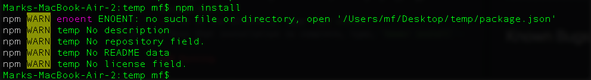

# StackOverwhelm

## Mark Fisher
## 4.28.2017

---

## Description
StackOverflow is an astoundingly effective tool for asking technical questions about programming and getting high-quality answers. Several factors contribute to this high quality, including i) a reputation-based hierarchy that grants more seasoned users various rights and privileges that a beginning user does not have and ii) an established culture of question and answer policing that strongly discourages question posters from asking questions that have been asked before or aren't easily reproduced by would-be responders.

All of this is wonderful, and it's hard to imagine how to improve on StackOverflow's system (we all know that [other things have been tried with terrifying results](https://answers.yahoo.com/)).

One unfortunate side effect of this rock-solid system, however, is that it can be very overwhelming for a beginning user. Asking your first (or tenth) question on StackOverflow can be a harrowing experience, and noobies are often greeted by a flurry of down-votes, moves to close questions, angry or at best passive-aggressive comments demanding that code be made reproducible or adhere perfectly to question-asking guidelines. There is a steep, albeit worthwhile, learning investment in asking good questions.

The problem is not this demand for quality. Indeed, questioners often discover their own answers while trying to create reproducible versions of their original questions. The problem instead is the hostility with which naive users are met. What a welcome to the coding community, right?!

Enter StackOverwhelm. StackOverwhelm aims to be a very bare-bones riff on StackOverflow upon which new users can cut their question-asking teeth and get answers to embarrassing newbie questions. It's the home gym to StackOverflow's beach-side outdoor muscle gym.

*I, for one, never want to exercise again after seeing this*

When the product is complete, users will have reputation scores that can be affected by the politeness and patience of their responses.

StackOverwhelm: Quality without the Attitude

### Video Tour

---

## Prerequisites

You will need the following things properly installed on your computer.

* [Git](https://git-scm.com/)
* [Node.js](https://nodejs.org/) (with NPM)
* [Bower](https://bower.io/)
* [Ember CLI](https://ember-cli.com/)
* [PhantomJS](http://phantomjs.org/)

---

## Dependencies

* Bootstrap (should be set up automatically upon build of this webapp, but if not, simply navigate to the project directory in terminal and type, `ember install ember-bootstrap`)
* Firebase (should be set up automatically upon build of this webapp, but if not, simply navigate to the project directory in terminal and type, `ember install emberfir`)

---

## Setup

### Installation

* Open a terminal session [on a Mac](http://www.imore.com/how-use-terminal-mac-when-you-have-no-idea-where-start) | [in Windows](https://gist.github.com/jirutka/99d57c82fa8981f56fb5)
* Type, `git clone https://github.com/Atticus29/n00b-message-board.git`
* Navigate to the newly-created repository by typing, `cd message-board`
* Once in the directory, type `npm install`
  * A successful installation might look something like this: 
* Once that installation is complete, type, `bower install`
  * You may not see anything at all after typing this.

### Running

* Now type, `ember serve`
* Visit your app in any browser by clicking [here](http://localhost:4200) or typing http://localhost:4200 into your browser's URL field.

---

## Specs/User stories
| Behavior                   | Input Example     | Output Example    |
| -------------------------- | -----------------:| -----------------:|
|User should be able to ask a new question|User adds a question and fills out details about the question|Question is recorded by the app|
|User should be able to answer questions posted by themselves or by other users |User answers a question by filling out details|Answer is recorded by the app and associated with a particular question|
|User should be able to edit questions|User edits question details|Updates recorded by the app.|
|User should be able to edit answers|User edits answer details|Updates recorded by the app.|

---

## Known Bugs/Future Directions

* Currently, the key to firebase is on display for the world to see. Eventually, this should be migrated to a .env file.
* Currently, the ability to update question's down-votes and up-votes is not fully functional.
* Improve input validation for tags.

### Future Specs
| Behavior                   | Input Example     | Output Example    |
| -------------------------- | -----------------:| -----------------:|
|User should be able to provide question-asking tips to question posters|User adds a tip to a question by filling out details|Tip is recorded by the app and associated with particular question|

---

## Planning
1. Questions should include the content of the question itself, an author, and additional notes.
  * Entry (model)
    * Question (text)
    * Author (text)
    * Details (text)
    * Tags (strings separated by commas)
    * Answers (hasMany)
    * UpCount (integer)
    * DownCount (integer)
    * tips (hasMany)
  * Answer (model)
    * UpCount (integer)
    * DownCount (integer)
    * Author (text)
    * Details (text)
    * Entry (has one)
  * tips (model) for giving advice to the question asker about how to improve their question
    * Author (text)
    * Details (text)
    * Entry (has one)
    * UpCount (integer)
    * DownCount (integer)
1. Include a header and/or navbar that appears on all pages.    
 * It should contain the name of your site
 * A link to the home page, and
 * Other content such as LinkedIn, github etc. in footer and/or sidebar.

### Components
1. question-display: displays abbreviated details of a question in the questions route.
1. question-form: displays the form for creating a new question.
1. answer-display: answers should be viewed on the same page as the question they respond to.
1. add-answer: displays the form for creating a new answer.

### Routes/Integration
1. ask: manages question submission.
1. questions: lists all questions on one page.
1. question: lists one question in more detail
1. index: demo video and link to readme

### Functionality (see specs table above)

#### UI/UX
1. Styling theme

### Polish
1. Responsive components
1. Add video to README/clean up
1. Flesh out bugs and future directions section.
1. DRY up/delete unused
1. Badges
1. Heroku deployment

## Planning Checklist
- [x] Application template contains header with link(s).
- [x] Data is stored in and retrieved from Ember Data models and Firebase.
- [x] Components are used to create display and behavior for your templates.
- [x] One-to-many relationship exists between Question and Answers.
- [x] Application works as expected.
- [x] Project is in a presentable, portfolio-quality state.
- [x] Required functionality is in place by Friday deadline.
- [x] Code and Git documentation follow best practices, including a planning section in your README as described in this weeks documentation lesson.
- [x] Project demonstrates understanding of week's concepts.
- [x] If prompted, you are able to discuss your code with an instructor using correct terminology.

## Supplementary Checklist
- [ ] Extend the model to allow for additional features.
Create a User model.
- [ ] Implement full CRUD. Allow questions and answers to be deleted.
- [ ] Add user authentication and/or authorization to create an admin panel. Allow only verified admin accounts to edit or delete questions.
- [x] Integrate custom styling.
- [ ] Implement upvote/downvote functionality so that users may vote on answers.
- [x] Add tags to questions. How will you handle multiples of the same tag? How do users enter tags?
- [ ] Add ability to render markdown in questions and answers [try this](https://emberobserver.com/addons/markdown-code-highlighting)
- [ ] User has to justify downvotes
- [ ] Add timestamp to question and display them in order of recentness

---

# License

The MIT License (MIT)

Copyright (c) 2017 Mark Fisher

Permission is hereby granted, free of charge, to any person obtaining a copy
of this software and associated documentation files (the "Software"), to deal
in the Software without restriction, including without limitation the rights
to use, copy, modify, merge, publish, distribute, sublicense, and/or sell
copies of the Software, and to permit persons to whom the Software is
furnished to do so, subject to the following conditions:

The above copyright notice and this permission notice shall be included in
all copies or substantial portions of the Software.

THE SOFTWARE IS PROVIDED "AS IS", WITHOUT WARRANTY OF ANY KIND, EXPRESS OR
IMPLIED, INCLUDING BUT NOT LIMITED TO THE WARRANTIES OF MERCHANTABILITY,
FITNESS FOR A PARTICULAR PURPOSE AND NONINFRINGEMENT.  IN NO EVENT SHALL THE
AUTHORS OR COPYRIGHT HOLDERS BE LIABLE FOR ANY CLAIM, DAMAGES OR OTHER
LIABILITY, WHETHER IN AN ACTION OF CONTRACT, TORT OR OTHERWISE, ARISING FROM,
OUT OF OR IN CONNECTION WITH THE SOFTWARE OR THE USE OR OTHER DEALINGS IN
THE SOFTWARE.
